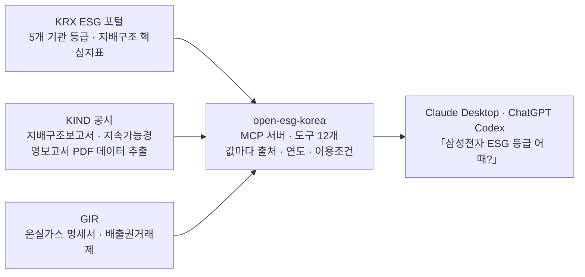

<div align="center">


# open-esg-korea

**한국 상장사 ESG 데이터를 AI 에게 바로 물어볼 수 있게 하는 MCP 서버**

「삼성전자 ESG 등급 어때?」 — 이렇게 물으면 됩니다.

[](LICENSE)
[](https://github.com/MarcoYou/open-esg-korea/releases/latest)
[](https://www.python.org/downloads/)
[](https://modelcontextprotocol.io/)
[](#도구-12개)
[](https://github.com/sponsors/MarcoYou)

[](#1단계--내-컴퓨터에-맞는-파일-받기)
[](#1단계--내-컴퓨터에-맞는-파일-받기)
[](#무엇이-들어-있나)
[](#3단계--물어보기)
[](#라이선스)

**[English](README_ENG.md)**

[설치](#-5분-설치) · [이렇게 물어보세요](#-이렇게-물어보세요) · [도구 12개](#도구-12개) · [읽을 때 주의](#읽을-때-주의) · [라이선스](#라이선스) · [개발자용](#개발자용) · [문서](#문서)

</div>

---

[KRX ESG 포털](https://esg.krx.co.kr)·[GIR 온실가스종합정보센터](https://www.gir.go.kr)·[KIND 공시](https://kind.krx.co.kr)에
흩어진 **기관별 ESG 등급 · 온실가스 배출량 · 지배구조 지표 · 보고서 원문**을
AI 클라이언트(Claude Desktop, Cursor 등)가 자연어로 바로 물을 수 있게 하는 게이트웨이입니다.

형제 프로젝트 [open-proxy-mcp](https://github.com/MarcoYou/open-proxy-mcp)(DART 공시 분석)와 같은 구조입니다.



세 곳 다 **API 키 없이** 조회됩니다. 등급은 저장하지 않고 물을 때마다 실시간으로 가져옵니다.

> [!IMPORTANT]
> **코드는 Apache-2.0 입니다 — 상업 이용을 포함해 자유롭게 쓰시고, 출처만 밝혀 주세요.**
> 다만 **이 서버가 읽어오는 등급 데이터는 그 라이선스에 들어가지 않습니다.** 등급은 각 평가기관의
> 저작물이고 **다섯 기관 모두 대외 공개를 금지**합니다. 이 서버는 값을 저장하지 않고 물을 때마다
> 실시간으로 가져오지만, 받아본 값을 수집·재배포하는 것은 별개 문제입니다.
> [라이선스](#라이선스) 절을 꼭 읽어 주세요.

---

## 🚀 5분 설치

**파일 하나 받아서 끌어다 놓으면 끝입니다.** 파이썬도, 개발도구도, API 키도 필요 없습니다.

### 1단계 — 내 컴퓨터에 맞는 파일 받기

<div align="center">

| 내 컴퓨터 | 받기 | 크기 |
|:---|:---:|:---:|
| **Mac** — M1·M2·M3·M4 등 | [](https://github.com/MarcoYou/open-esg-korea/releases/latest/download/open-esg-korea-macos-arm64.mcpb) | 약 40MB |
| **Mac** — 인텔 | [](https://github.com/MarcoYou/open-esg-korea/releases/latest/download/open-esg-korea-macos-x64.mcpb) | 약 44MB |
| **Windows** — 64비트 | [](https://github.com/MarcoYou/open-esg-korea/releases/latest/download/open-esg-korea-windows-x64.mcpb) | 약 43MB |

</div>

<sub>**내 Mac 이 어느 쪽인지 모르겠다면** —  메뉴 → 「이 Mac에 관하여」에서 **칩**에 `Apple M…` 이라고
쓰여 있으면 Apple Silicon, `Intel…` 이라고 쓰여 있으면 인텔입니다. 2020년 이후 산 Mac 은 거의 Apple Silicon 입니다.
잘못 받아도 설치만 안 될 뿐 아무 일도 생기지 않습니다.</sub>

<sub>리눅스용 번들은 아직 없습니다 — [개발자용](#개발자용)으로 연결하세요.</sub>

### 2단계 — Claude Desktop 에 끌어다 놓기

1. **Claude Desktop** 을 엽니다
2. **설정 → 확장(Extensions)** 으로 갑니다
3. 받은 **`.mcpb` 파일을 창 안으로 끌어다 놓습니다** (또는 「확장 프로그램 설치」로 파일 선택)
4. **설치**를 누릅니다

> [!NOTE]
> 「이 확장 프로그램이 컴퓨터의 모든 항목에 액세스할 수 있습니다 · 개발자 정보를 Anthropic 에서 확인하지
> 않았습니다」라는 빨간 경고가 뜹니다. **Anthropic 이 심사한 공식 확장이 아니라는 뜻**이고, 개인이 만든
> 확장은 전부 이렇게 표시됩니다. 안에 무엇이 들었는지는 [`scripts/build_mcpb.py`](scripts/build_mcpb.py) 에
> 전부 적혀 있고, 압축을 풀면 `lib/` 아래 파이썬 코드를 그대로 읽을 수 있습니다.

### 3단계 — 물어보기

Claude 에게 그냥 한국어로 물어보세요.

> **삼성전자 ESG 등급 알려줘**

5개 기관 등급표가 **출처·연도·이용조건과 함께** 나오면 성공입니다. API 키를 넣는 단계는 없습니다.

<details>
<summary><b>🛠️ 설치가 안 될 때</b></summary>

<br>

| 증상 | 왜 그런가 / 어떻게 하나 |
|---|---|
| **설치 버튼이 회색이고 안 눌림** | 「요구 사항」에 ⚠ 가 하나라도 있으면 잠깁니다. `Python` 요구가 보이면 **옛날 파일**입니다 — 최신 릴리스를 받으세요(파이썬은 번들 안에 들어 있어 따로 필요 없습니다) |
| **「확장 프로그램을 미리 볼 수 없습니다」** | 매니페스트를 못 읽은 것입니다. 최신 릴리스를 받으세요 |
| **설치는 됐는데 도구가 안 보임** | Claude Desktop 을 **완전히 종료**했다 켜세요. macOS 는 `⌘Q`, 윈도우는 창 닫기 ✕ 가 아니라 트레이 아이콘 → 종료입니다 |
| **(Mac) 「incompatible architecture」 오류** | 칩에 안 맞는 파일입니다 — 위 표에서 다른 쪽을 받으세요 |
| **(Mac) 실행이 막히는 것 같을 때** | 내려받은 파일에 격리 딱지가 붙었을 수 있습니다. 터미널에서<br>`xattr -dr com.apple.quarantine ~/Library/Application\ Support/Claude/Claude\ Extensions/local.mcpb.MarcoYou.open-esg-korea`<br>실행 후 Claude Desktop 을 다시 켜세요 |
| **회사 이름을 물으면 오류가 남** | 사내망이 KRX 접속을 막고 있을 수 있습니다. 브라우저로 [esg.krx.co.kr](https://esg.krx.co.kr) 이 열리는지 먼저 확인하세요 |
| **그래도 안 됨** | [이슈로 알려주세요](https://github.com/MarcoYou/open-esg-korea/issues) — 확장 폴더 안 `BUILD_INFO.txt` 내용을 같이 붙여 주시면 빠릅니다 |

</details>

### 무엇이 들어 있나

| | |
|---|---|
| `runtime/` | 파이썬 3.12 배포판 — **컴퓨터에 파이썬이 없어도 됩니다**<br><sub>Windows: python.org 임베드 배포판 · macOS: [python-build-standalone](https://github.com/astral-sh/python-build-standalone)</sub> |
| `lib/` | 의존성(mcp · httpx · pypdfium2 · pdfplumber) + 서버 본체 |
| `manifest.json` | 확장 정보와 도구 12개 목록 |
| `BUILD_INFO.txt` | 어느 커밋·언제·무엇으로 만들었는지 |

---

## 💬 이렇게 물어보세요

설치하고 나면 도구 이름을 외울 필요가 없습니다. 하고 싶은 말을 그냥 하면 Claude 가 알아서 고릅니다.
아래는 실제로 되는 질문들입니다.

<details open>
<summary><b>📊 등급이 궁금할 때</b></summary>

> - 삼성전자 ESG 등급 알려줘
> - 현대차랑 기아 ESG 등급 비교해줘
> - LG화학 KCGS 등급 3년 추이 보여줘
> - SK하이닉스 등급, 같은 기관 안에서는 어느 정도 위치야?

기관 5곳(KCGS · MSCI · 한국ESG연구소 · S&P · 서스틴베스트)의 ESG/E/S/G 등급이 **연도별로** 나오고,
「좋은 편인가」는 **같은 기관 안에서 세어서**(이 등급 이상 몇 사 · 동점 몇 사) 답합니다.
기관끼리는 스케일이 달라 나란히 비교하지 않습니다 — [왜 그런지](#읽을-때-주의)

</details>

<details>
<summary><b>🏭 온실가스 배출량이 궁금할 때</b></summary>

> - SK하이닉스 온실가스 배출량 최근 5년치 보여줘
> - 포스코홀딩스 배출권 할당량 대비 실제 배출량은?
> - 삼성전자 GIR 명세서 수치랑 보고서에 실린 수치 비교해줘
> - 철강 업종 배출량 순위 알려줘
> - 우리나라 도로수송 부문 온실가스 1990년부터 어떻게 변했어?

GIR 명세서(회사별) · 배출권거래제 할당 대비 인증배출량 · 지정업종 순위 · 국가 인벤토리(1990~)를 다룹니다.
회사 보고서 공시치와 대조할 때는 값을 단정하지 않고 **범위 축**(경계 · Scope 2 방식 · NF₃ 포함 여부)을 함께 줍니다.

</details>

<details>
<summary><b>🏛️ 지배구조가 궁금할 때</b></summary>

> - 네이버 기업지배구조 핵심지표 15개 어떻게 돼?
> - 카카오가 미준수한 항목이 뭐고, 회사는 이유를 뭐라고 썼어?
> - 셀트리온이랑 삼성바이오로직스 지배구조 지표 비교해줘

**두 층**으로 답합니다 — KRX 가 집계한 O/X 지표(15개)·정책 채택 여부(74개)와,
**회사가 직접 쓴 보고서 원문**(세부원칙 28개 답변 · 미준수 사유). 「왜 미준수인지」는 원문에만 있습니다.

</details>

<details>
<summary><b>📄 보고서 원문을 읽고 싶을 때</b></summary>

> - 삼성전자 지속가능경영보고서 목차 보여줘
> - 그 보고서에서 '재생에너지' 나오는 대목 찾아줘
> - 42쪽 전체 보여줘

지속가능경영보고서 목록 · 검증기관 · 첨부 PDF 주소를 주고, **PDF 본문을 직접 읽어** 키워드가 몇 쪽에 있는지,
그 대목이 무엇인지 발췌해 줍니다. 검색은 자간 공백을 무시하므로 「온실가스 배출량」처럼 띄어 조판된 것도 찾습니다.

</details>

<details>
<summary><b>🔍 여러 회사를 한 번에 훑고 싶을 때</b></summary>

**추리기**

> - KCGS A+ 이상인 회사 중에 「반도체및반도체 장비」 산업군만 뽑아줘
> - 지속가능경영보고서 낸 유가증권 상장사 목록 보여줘
> - 화학 업종에서 MSCI 등급 있는 회사만

**업종·산업군끼리 비교하기**

> - 「반도체및반도체 장비」랑 「자동차및부품」, 어느 산업군의 KCGS 등급 분포가 더 좋아?
> - 「은행」 산업군 회사들 ESG 등급 한 표로 비교해줘
> - 「소재」 산업군에서 등급 상위권만 추려서 온실가스 배출량이랑 같이 보여줘

유가증권 전체(2025년 795사)를 대상으로 **기관별 최소 등급 · 업종 · GICS 산업군 · 보고서 유무**로 거르고,
결과가 어느 산업군에 몰려 있는지도 같이 보여 줍니다. 산업군끼리 견줄 때도 **같은 기관 안에서** 셉니다 —
기관이 다르면 스케일이 달라 한 줄에 놓지 않습니다.

<sub>산업군 이름은 GICS 25개 분류를 그대로 씁니다(자본재 · 소재 · 하드웨어및IT장비 · 반도체및반도체 장비 ·
자동차및부품 · 은행 …). 포털 업종(21개)·GIR 지정업종과는 [다른 체계](#읽을-때-주의)입니다.</sub>

</details>

### 알아두면 편한 것

- **회사 이름은 통칭도 됩니다** — 「현대차」「에스케이하이닉스」「삼성SDS」「케이티앤지」 다 알아듣습니다. 별칭이 쓰이면 응답에 그 사실이 적힙니다.
- **`-` 는 「미평가」입니다** — 0 점도, 나쁜 등급도 아닙니다. 자료가 없으면 그렇다고 말합니다.
- **코스닥은 등급표까지만** 나옵니다 — 포털이 보고서·지배구조 화면에는 유가증권만 싣습니다.
- **모든 값에 출처·연도·이용조건이 붙습니다.** 응답의 `license` 를 지우지 마세요.

---

<div align="center">

**이 프로젝트가 도움이 되셨나요?**

후원을 해주신다면 유지·보수에 큰 힘이 됩니다.

[](https://github.com/sponsors/MarcoYou)

</div>

---

## 도구 (12개)

| 도구 | 무엇을 답하나 |
|---|---|
| `company` | 회사명/종목코드 → 포털 종목코드·ISIN. 모든 도구의 입구 |
| `esg_ratings` | KCGS·MSCI·한국ESG연구소·S&P·서스틴베스트 ESG/E/S/G 등급(연도별) + KCGS 3년 추이 + **같은 기관 안의 분포**(이 등급 이상 몇 사·동점 몇 사) |
| `sustainability_reports` | 지속가능경영보고서 목록 + 최신 한 건의 공시 원문 — 보고 대상 기간·목차·검증기관·회사 공개처·첨부 PDF 주소 |
| `sustainability_report_text` | 지속가능경영보고서 **PDF 본문** — 키워드가 몇 쪽에 있는지·그 대목 발췌·쪽 전체 보기 |
| `governance_indicators` | 기업지배구조 핵심지표 15개 O/X · 준수율 · 회사 비교 |
| `governance_policies` | 지배구조 정책 채택 여부 74개 항목 |
| `governance_report` | 기업지배구조보고서 **원문** — 세부원칙 28개 답변·서식 표·미준수 사유(왜 미준수인지) |
| `esg_disclosures` | 기업지배구조보고서 공시 이력(정정 포함) |
| `esg_screener` | 유가증권 전체(2025: 795사) 등급 스크리너 — 기관별 최소 등급·업종·**GICS 산업군**·보고서 유무 + 결과의 산업군 분포 |
| `ghg_emissions` | 회사별 온실가스 배출량(GIR 명세서, tCO₂eq·에너지 TJ·검증기관) + 5년 추이 + 배출권거래제 할당 대비 인증 배출량 · `report=True` 면 보고서 공시치를 **범위와 함께** 대조 |
| `ghg_industry` | 지정업종별 배출량 순위 · 업종 안 법인 순위와 비중 (명세서 합산) |
| `ghg_national_inventory` | 국가 온실가스 인벤토리 — 총량·5개 분야·세부 부문(철강·시멘트·도로수송…) 1990~ 시계열 |

---

## 읽을 때 주의

- 기관마다 스케일이 다릅니다(KCGS S~D, MSCI AAA~CCC, S&P 0-100 점수, 서스틴베스트 AA~E). 기관 간 등급을 나란히 비교하지 마세요.
- **GICS 산업군**(경제섹터 11 · 산업군 25)이 모든 응답의 회사 정보에 붙습니다. 동봉 스냅샷
  (`open_esg_korea/data/krx_gics.json`, KOSPI+KOSDAQ 2,534종목)이라 키·네트워크 없이 됩니다.
  포털 업종(21개)·GIR 지정업종과는 **다른 체계**입니다 — 삼성전자는 각각 하드웨어및IT장비 / 전기·전자 /
  반도체 제조업입니다. 한 표에 섞지 마세요.
- 「좋은 편인가」는 **같은 기관 안의 분포**로 답합니다 — 「상위 N%」는 만들지 않습니다. 등급이 6~7단계뿐이라
  동점이 30~60%여서(한국ESG연구소는 A 등급에 61%) 백분위가 지어낸 정밀도가 됩니다. 분모는 그 기관이
  평가한 회사 수이고, 기관마다 평가 대상이 다릅니다(2025년: KCGS 782사 · MSCI 74사).
- `-`(null)는 **그 기관이 평가하지 않았다**는 뜻입니다.
- 포털 검색기는 유가증권 상장사만 다룹니다. 코스닥 **회사명** 검색은 저장소에 동봉한 상장사 명부 스냅샷
  (`open_esg_korea/data/listed_companies.json`, OpenDART 고유번호 명부에서 매월 갱신)으로 종목코드를 찾습니다 — 키 없이 됩니다.
  `OPENDART_API_KEY`(무료, [opendart.fss.or.kr](https://opendart.fss.or.kr)) 를 주면 스냅샷 대신 실시간 명부를 씁니다(그 사이 상장·개명한 회사까지).
  어느 쪽이든 코스닥은 등급표만 나오고 보고서·지배구조 화면은 비어 있을 수 있습니다(포털이 유가증권만 싣습니다).
- 회사명은 통칭·음차·영문 표기를 알아듣습니다(「현대차」「에스케이하이닉스」「삼성SDS」「케이티앤지」). 별칭이 쓰이면 응답에 그 사실이 적힙니다.
- `company` 응답의 `corp_code`(DART 고유번호)는 형제 서버 open-proxy-mcp 의 도구에 그대로 넘길 수 있습니다.
- 온실가스는 [온실가스종합정보센터(GIR)](https://www.gir.go.kr/home/index.do?menuId=37) 명세서 공개정보입니다 — 배출권거래제·목표관리제
  대상 업체(연 1,170개 안팎)만 있고, 없으면 `no_data` 이지 0 이 아닙니다. 검증된 규제 기준(직접+간접)이라 보고서의 Scope 1·2·3 과 다를 수 있습니다.
  자회사가 따로 지정된 경우(삼성디스플레이·포스코퓨처엠)는 「관련 법인」으로 보여 줍니다. 키 없이 조회됩니다.
- 지배구조는 두 층입니다. `governance_indicators`(15개 O/X)·`governance_policies`(74개 Y/N)는 **KRX 가 집계한 값**이고,
  `governance_report` 는 **회사가 쓴 원문**(KIND)입니다 — 「왜 미준수인가」는 원문에만 있습니다. 원문에서 아무것도 읽지 못하면
  「0개 준수」가 아니라 「읽지 못함」으로 답합니다. 금융회사는 「지배구조 연차보고서」로 갈음해 세부원칙이 없습니다(미제출·미준수가 아닙니다).
- 지속가능경영보고서 PDF 본문은 `sustainability_report_text` 로 읽습니다. **검색은 공백을 무시합니다** —
  원문이 자간을 벌려 조판해 「온실가스 배출량」처럼 띄어져 있어, 그대로 찾으면 있는 내용도 0건이 됩니다.
  못 찾으면 「없다」가 아니라 「이 표기로 못 찾았다」입니다. 이미지로만 된 PDF 는 읽지 못합니다(OCR 하지 않습니다).
- **보고서의 수치를 기계적으로 뽑지 않습니다.** 표는 원문 배치를 편 형태로 돌려주며, 값이 어느 연도·부문인지는
  원문 PDF 로 확인해야 합니다 — 2단 조판 페이지에서 두 표가 섞이는 것을 확인했습니다.
  `table=True` 로 격자를 받을 수도 있지만 **실험적**입니다: 값 보존이 97.4%(정렬 텍스트는 100%)이고,
  쪼개진 것으로 보이는 칸은 `⚠` 로 표시해 돌려줍니다. 의심 칸이 0이 아니면 정렬 텍스트와 대조하세요.
- 공시 목록의 접수번호는 **KIND(거래소) 번호**입니다. DART 접수번호와 체계가 달라, 같은 번호로 DART 뷰어를 열면 다른 회사 공시가 나옵니다.
- **GIR 값과 보고서 공시치는 범위만 맞추면 사실상 같습니다** — 회사가 GIR 에 낸 명세서를 보고서에도 싣기 때문입니다
  (실측 2024년: 포스코홀딩스 1톤·현대차 10톤·SK하이닉스 0.10%·LG화학 0.50% 차이). 벌어지는 건 보고서 표지 숫자가
  대개 **글로벌**이라서입니다(삼성전자 9%). `ghg_emissions(report=True)` 는 값을 단정하지 않고 **원문 발췌와
  범위 축**(경계 · Scope 2 지역/시장기반 · NF3 포함 여부)을 함께 줍니다 — 한 보고서 안에 값이 여럿일 수 있습니다
  (SK하이닉스 2024년은 셋). Scope 3 는 GIR 에 없어 보고서가 유일한 출처입니다.
- **평가정보는 각 기관의 저작물이고 조건이 기관마다 다릅니다** — KCGS·MSCI 는 「내부 용도로만」, 서스틴베스트·S&P 는
  「사전 서면허가 없이 어떤 형태의 복제도 불가」, 한국ESG연구소는 「사전 서면동의 없이 복제·전송·인용·배포 불가」입니다.
  **다섯 곳 모두 대외 공개는 안 됩니다.** 그래서 이 서버는 등급을 **실시간으로만** 가져오고 DB·저장소·로그 어디에도
  남기지 않으며(캐시는 메모리뿐), 등급마다 그 기관의 고지와 [원문 주소](https://esg.krx.co.kr/templets/mobile/notice-box.jsp?type=kcgs)를
  붙여 돌려줍니다. 응답의 `license` 를 지우지 마세요. **공개 엔드포인트로 띄우려면 각 기관에 먼저 문의해야 합니다** —
  개인이 자기 조회용으로 쓰는 것(로컬 stdio, 또는 본인만 닿는 비공개 배포)은 내부 용도입니다.
  공시 원문은 제출 회사의 문서이므로 `governance_report` 는 그 고지를 따로 싣습니다.

---

## 라이선스

**코드는 [Apache License 2.0](LICENSE) 입니다.** 상업적 이용을 포함해 자유롭게 쓰고, 고치고, 배포하고,
이걸로 제품을 만들어 파셔도 됩니다. 조건은 하나 — **출처를 밝히는 것**입니다.

구체적으로는 재배포본에 [`LICENSE`](LICENSE) 와 [`NOTICE`](NOTICE) 를 함께 두고, open-esg-korea 에서
파생했음을 밝히면 됩니다. 파일을 고쳤다면 고쳤다고 적어 주세요. 그게 전부입니다.

> [!WARNING]
> **이 라이선스는 소프트웨어에 대한 것이지, 소프트웨어가 읽어오는 데이터에 대한 것이 아닙니다.**
>
> ESG 등급은 각 평가기관의 저작물이고 조건이 기관마다 다릅니다 — KCGS·MSCI 는 「내부 용도로만」,
> 서스틴베스트·S&P 는 「사전 서면허가 없이 어떤 형태의 복제도 불가」, 한국ESG연구소는 「사전 서면동의
> 없이 복제·전송·인용·배포 불가」입니다. **다섯 곳 모두 대외 공개는 안 됩니다.**
>
> 코드를 상업적으로 써도 된다는 것이 **등급을 수집·저장·재배포·재판매해도 된다는 뜻이 아닙니다.**
> 공개 엔드포인트로 띄우거나 등급 자체로 상품을 만들려면 **각 기관에 먼저 문의해야 합니다.**

그래서 이 서버는 등급을 실시간으로만 가져오고 DB·저장소·로그 어디에도 남기지 않으며(캐시는 메모리뿐),
값마다 그 기관의 고지와 원문 주소를 붙여 돌려줍니다. 응답의 `license` 칸을 지우지 마세요.
공시 원문은 제출 회사의 문서이고, 온실가스 수치는 GIR 공개정보로 각자의 조건을 따릅니다.

자세한 것은 [`NOTICE`](NOTICE) 에 있습니다.

## 개발자용

```bash
uv sync
uv run python -m open_esg_korea                     # http://localhost:8000/mcp
uv run python -m open_esg_korea --transport stdio   # Claude Desktop 로컬 연결
```

Claude Desktop `claude_desktop_config.json` 예:

```json
{"mcpServers": {"open-esg-korea": {"command": "uv", "args": ["run", "--directory", "/path/to/open-esg-korea",
  "python", "-m", "open_esg_korea", "--transport", "stdio"]}}}
```

### 확장(.mcpb) 직접 만들기

```bash
uv run python scripts/build_mcpb.py                        # 지금 이 기계용 하나
uv run python scripts/build_mcpb.py --target macos-arm64   # 하나 지정
uv run python scripts/build_mcpb.py --target all --check   # 셋 다 + 만든 뒤 실제로 실행해 확인
```

| `--target` | 런타임 | `--check` |
|---|---|---|
| `macos-arm64` | python-build-standalone (aarch64) | Apple Silicon 에서 |
| `macos-x64` | python-build-standalone (x86_64) | Intel Mac, 또는 **Rosetta 2 가 깔린 Apple Silicon** 에서 |
| `windows-x64` | python.org 임베드 배포판 | 윈도우에서 |

`--check` 는 만든 번들을 풀어서 **매니페스트에 적힌 명령 그대로** 띄우고 stdio 핸드셰이크로
도구 12개가 응답하는지 확인합니다 — 「빌드는 됐는데 안 열린다」를 막습니다.
이 기계에서 못 돌리는 타깃은 건너뜁니다.

### 테스트

```bash
uv sync --dev && uv run pytest -q     # network 0
```

---

## 문서

- [MCP 초안·로드맵](docs/mcp-draft.md) — 데이터 소스 지도, 엔드포인트 확인 내용, Phase 별 근거
- [실측 노트](docs/anecdotes.md) — 두드려 보고 나서야 알게 된 것들(DART 링크가 다른 회사를 연다, 자간 공백이 PDF 에 박혀 있다, 벤치마크 1위 파서가 우리 수치표를 못 잡는다…)

### 스냅샷 갱신

| 무엇 | 명령 | 자동화 |
|---|---|---|
| GICS 산업분류 | `uv run python scripts/refresh_krx_gics.py` | 워크플로 `refresh-krx-gics` (매월 1일, **키 불필요**) |
| 상장사 명부 | `OPENDART_API_KEY=... uv run python scripts/refresh_listed_companies.py` | 워크플로 `refresh-listed-companies` (secret `OPENDART_API_KEY` 필요) |
| 국가 인벤토리 | `python3 scripts/refresh_ghg_inventory.py --url '<공공데이터포털 15049589 다운로드 URL>'` | 없음 (연 1회, 12월 공표 후) |

### 실서버 점검

```bash
python scripts/probe_krx.py 005930 2025   # 포털 응답 스키마가 바뀌었는지
uv run python scripts/smoke_kind.py       # KIND 공시 원문(지배구조·지속가능)이 아직 읽히는지
```

