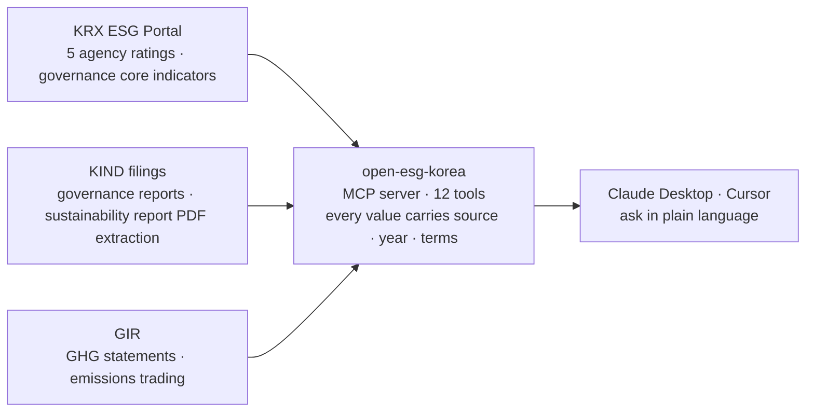

<div align="center">


# open-esg-korea

**Ask an AI about Korean listed companies' ESG data, in plain language**

"What is Samsung Electronics' ESG rating?" — that is the whole interface.

[](https://github.com/MarcoYou/open-esg-korea)
[](LICENSE)
[](https://github.com/MarcoYou/open-esg-korea/releases/latest)
[](https://www.python.org/downloads/)
[](https://modelcontextprotocol.io/)
[](#tools-12)
[](https://github.com/sponsors/MarcoYou)

[](#step-1--pick-the-file-for-your-machine)
[](#step-1--pick-the-file-for-your-machine)
[](#what-is-inside)
[](#step-3--ask)
[](#license)

**[한국어](README.md)**

[Install](#-install-in-5-minutes) · [ChatGPT](docs/connect-chatgpt.md) · [What to ask](#-what-to-ask) · [Tools (12)](#tools-12) · [Reading the output](#reading-the-output) · [License](#license) · [For developers](#for-developers)

</div>

---

A gateway that makes ESG data on Korean listed companies easier, faster, and AI-friendly to reach — an MCP server.

It takes the **agency ESG ratings, greenhouse-gas emissions, governance indicators and report full text** scattered across
the [KRX ESG Portal](https://esg.krx.co.kr), [GIR](https://www.gir.go.kr) and [KIND filings](https://kind.krx.co.kr), and
lets AI clients (Claude Desktop, Cursor, and others) ask about them in plain language.
Same shape as its sibling project [open-proxy-mcp](https://github.com/MarcoYou/open-proxy-mcp) (DART filings analysis).



All three are reachable **without an API key**. Ratings are never stored — they are fetched live on each question.

> [!IMPORTANT]
> **The code is Apache-2.0 — use it commercially if you like; just credit the source.**
> But **the rating data this server reads is not covered by that licence.** Ratings are each agency's copyrighted work
> and **none of the five permit public disclosure**. The server stores nothing and fetches live on every question, but
> what you do with the values you receive is a separate matter. Please read the [License](#license) section.

---

## 🚀 Install in 5 minutes

**Download one file and drop it in.** No Python, no developer tools, no API key.

<sub>**What you need** — [Claude Desktop](https://claude.com/download) (free download) and a Claude account.
**The free plan is enough to start**, though its message allowance is tight for sustained use, and a work
account may have extension installs locked down by an admin.
**On ChatGPT instead? → [Connecting to ChatGPT](docs/connect-chatgpt.md)**</sub>

### Step 1 — pick the file for your machine

<div align="center">

| Your machine | Download | Size |
|:---|:---:|:---:|
| **Mac** — M chip | [](https://github.com/MarcoYou/open-esg-korea/releases/latest/download/open-esg-korea-macos-arm64.mcpb) | ~40MB |
| **Mac** — Intel | [](https://github.com/MarcoYou/open-esg-korea/releases/latest/download/open-esg-korea-macos-x64.mcpb) | ~44MB |
| **Windows** — 64-bit | [](https://github.com/MarcoYou/open-esg-korea/releases/latest/download/open-esg-korea-windows-x64.mcpb) | ~43MB |

</div>

<sub>**Not sure which Mac you have?** The surest check is `uname -m` in Terminal — `arm64` means **Apple Silicon**,
`x86_64` means **Intel**. Or use the Apple menu (top-left) → *About This Mac* and read the **Chip** row (**Processor**
on Intel). Picking the wrong one only means the extension will not install — nothing breaks.</sub>

<sub>There is no Linux bundle yet — use the [developer path](#for-developers).</sub>

### Step 2 — drop it into Claude Desktop

1. Open **Claude Desktop** — get it at [claude.com/download](https://claude.com/download) if you do not have it (free)
2. Go to **Settings → Extensions**
3. **Drag the `.mcpb` file** into the window (or use "Install extension" and pick it)
4. Click **Install**

> [!NOTE]
> You will see a red warning: "This extension will have access to everything on your computer · The developer information
> shown has not been verified by Anthropic." That means **it is not an Anthropic-reviewed extension** — every self-built
> extension is marked this way. Everything that goes into the bundle is spelled out in
> [`scripts/build_mcpb.py`](scripts/build_mcpb.py), the Python under `lib/` is readable as-is once unzipped, and each
> bundle carries a `BUILD_INFO.txt` naming the commit it was built from.

### Step 3 — ask

Just talk to Claude.

> **What is Samsung Electronics' ESG rating?**

If a five-agency rating table comes back **with sources, years and licence terms attached**, you are connected.
There is no API key step.

### On ChatGPT instead?

`.mcpb` is a Claude Desktop format. On the ChatGPT side you attach the server to **Codex** (CLI, IDE extension,
or the Codex app) — also one command. Codex is included **even on the ChatGPT free plan**.

**→ [Connecting to ChatGPT](docs/connect-chatgpt.md)**

<details>
<summary><b>🛠️ When installation fails</b></summary>

<br>

| Symptom | Why / what to do |
|---|---|
| **Install button is greyed out** | It locks if any "Requirements" row shows ⚠. If you see a `Python` requirement you have an **old file** — get the latest release (Python is bundled) |
| **"Cannot preview this extension"** | The manifest could not be read. Get the latest release |
| **Installed, but no tools appear** | **Fully quit** Claude Desktop and reopen — `⌘Q` on macOS; on Windows the tray icon → Quit, not the window ✕ |
| **(Mac) "incompatible architecture"** | Wrong file for your chip — take the other Mac row above |
| **(Mac) it seems to be blocked from running** | The download may carry a quarantine flag. In Terminal run<br>`xattr -dr com.apple.quarantine ~/Library/Application\ Support/Claude/Claude\ Extensions/local.mcpb.MarcoYou.open-esg-korea`<br>then restart Claude Desktop |
| **Company lookups error out** | Your corporate network may be blocking KRX. Check that [esg.krx.co.kr](https://esg.krx.co.kr) opens in a browser first |
| **Still stuck** | [Open an issue](https://github.com/MarcoYou/open-esg-korea/issues) — pasting the extension folder's `BUILD_INFO.txt` makes it much faster |

</details>

### What is inside

| | |
|---|---|
| `runtime/` | A Python 3.12 distribution — **you do not need Python on the machine**<br><sub>Windows: python.org embeddable build · macOS: [python-build-standalone](https://github.com/astral-sh/python-build-standalone)</sub> |
| `lib/` | Dependencies (mcp · httpx · pypdfium2 · pdfplumber) plus the server itself |
| `manifest.json` | Extension metadata and the list of 12 tools |
| `BUILD_INFO.txt` | Which commit, when, and by what it was built |

---

## 💬 What to ask

You never need the tool names. Say what you want; Claude picks the tool.
These all work:

<details open>
<summary><b>📊 Ratings</b></summary>

> - What is Samsung Electronics' ESG rating?
> - Compare Hyundai Motor and Kia on ESG
> - Show LG Chem's 3-year KCGS trend
> - Where does SK hynix sit within that same agency?

ESG/E/S/G grades **by year** from five agencies (KCGS · MSCI · Korea ESG Research Institute · S&P · Sustinvest).
"Is this good?" is answered by **counting inside one agency** (how many at or above, how many tied) — never across
agencies, because the scales differ. [Why](#reading-the-output)

</details>

<details>
<summary><b>🏭 Greenhouse gas</b></summary>

> - SK hynix emissions for the last five years
> - POSCO Holdings: ETS allocation vs. verified emissions
> - Compare Samsung Electronics' GIR statement figures with what its report discloses
> - Rank the steel industry by emissions
> - How has Korea's road-transport sector changed since 1990?

Covers GIR statements (per company), ETS allocation vs. verified emissions, designated-industry rankings, and the
national inventory (1990 onward). When cross-checking a company's own report, it does not assert a value — it returns the
**scope axes** (boundary · Scope 2 method · whether NF₃ is included) alongside.

</details>

<details>
<summary><b>🏛️ Governance</b></summary>

> - How does Naver score on the 15 core governance indicators?
> - What did Kakao mark as non-compliant, and what reason did it give?
> - Compare Celltrion and Samsung Biologics on governance

Answered in **two layers** — the O/X indicators (15) and policy-adoption items (74) that KRX aggregates, and the
**report the company itself wrote** (28 detailed principles, stated reasons). The *why* exists only in the latter.

</details>

<details>
<summary><b>📄 Report full text</b></summary>

> - Show the table of contents of Samsung Electronics' sustainability report
> - Find where "renewable energy" appears in it
> - Show me page 42

Gives the report list, assurance provider and attached PDF address, then **reads the PDF body** to say which pages a
keyword is on and quote around it. Search ignores whitespace, so letter-spaced typesetting still matches.

</details>

<details>
<summary><b>🔍 Screening many companies at once</b></summary>

**Narrowing down**

> - KCGS A+ or better, semiconductors & semiconductor equipment only
> - Which KOSPI companies published a sustainability report?
> - Chemicals companies that have an MSCI rating

**Comparing industries against each other**

> - Semiconductors & equipment vs. automobiles & components — which industry group has the better KCGS spread?
> - Put every bank's ESG rating in one table
> - Take the top-rated materials companies and show their emissions alongside

Filters the whole KOSPI universe (795 companies in 2025) by **minimum grade per agency, portal industry, GICS industry
group, and whether a report exists**, and shows how the matches cluster by industry. Industry comparisons are still
counted **within one agency** — different agencies use different scales, so they never share a row.

<sub>Industry-group names follow the 25 GICS groups (Capital Goods · Materials · Technology Hardware & Equipment ·
Semiconductors & Semiconductor Equipment · Automobiles & Components · Banks …), which is a
[different scheme](#reading-the-output) from the portal's 21 industries and GIR's designated industries.</sub>

</details>

### Worth knowing

- **Short names work** — 현대차, 에스케이하이닉스, 삼성SDS, 케이티앤지 all resolve. When an alias is used, the response says so.
- **`-` means "not rated"** — not a zero, not a bad grade. Missing data is reported as missing.
- **KOSDAQ gets ratings only** — the portal carries KOSPI on the report and governance screens.
- **Every value carries source, year and licence terms.** Do not strip the `license` field from responses.

---

<div align="center">

**Has this project been useful to you?**

⭐ **A star** and your sponsorship go a long way toward keeping it maintained.
<sub>(The star badge above this document is just a link — clicking it does not star the repo. Use the **⭐ Star** button in the top right of this page instead.)</sub>

[](https://github.com/sponsors/MarcoYou)

</div>

---

## Tools (12)

| Tool | What it answers |
|---|---|
| `company` | Company name / ticker → portal ticker and ISIN. The entry point for every other tool |
| `esg_ratings` | ESG/E/S/G grades by year from KCGS, MSCI, Korea ESG Research Institute, S&P and Sustinvest, plus a 3-year KCGS trend and **the distribution within that same agency** (how many companies at or above this grade, how many tied) |
| `sustainability_reports` | List of sustainability reports plus the filing text of one — reporting period, table of contents, assurance provider, the company's own publication page, and the attached PDF address |
| `sustainability_report_text` | **PDF body** of a sustainability report — which pages a keyword appears on, excerpts around it, or a whole page |
| `governance_indicators` | The 15 core corporate-governance indicators (O/X), compliance rate, and comparison against another company |
| `governance_policies` | 74 governance policy-adoption items |
| `governance_report` | **Full text** of the corporate-governance report — answers to the 28 detailed principles, the standard-form tables, and the stated reasons for non-compliance |
| `esg_disclosures` | Filing history of corporate-governance reports (amendments included) |
| `esg_screener` | Screener across the whole KOSPI universe (795 companies in 2025) — minimum grade per agency, portal industry, **GICS industry group**, whether a sustainability report exists, plus how the matches cluster by industry |
| `ghg_emissions` | Company greenhouse-gas emissions (GIR statements, tCO₂eq · energy TJ · verifier) with a 5-year trend and ETS allocation vs. verified emissions. With `report=True` it cross-checks the figures disclosed in the report **together with their scope** |
| `ghg_industry` | Emissions ranking by designated industry, and each entity's rank and share within that industry (statement totals) |
| `ghg_national_inventory` | Korea's national greenhouse-gas inventory — totals, five sectors, and sub-sectors (steel, cement, road transport …) from 1990 onward |

## Reading the output

| What | Why |
|---|---|
| **Never line grades up across agencies** | The scales differ — KCGS S~D · MSCI AAA~CCC · S&P 0-100 score · Sustinvest AA~E |
| **`-` means "not rated"** | Not a zero, not a bad grade. Missing data is reported as `no_data` |
| **There is no "top N%"** | With only six or seven grades, 30–60% of companies tie (61% sit at A for Korea ESG Research Institute). "Is this good?" is answered by **counting inside one agency** |
| **Three industry schemes — do not mix them** | GICS industry groups (25) · portal industries (21) · GIR designated industries. Samsung Electronics is *Hardware & IT Equipment* / *Electrical & Electronics* / *Semiconductor Manufacturing* respectively |
| **KOSDAQ gets ratings only** | The portal carries KOSPI on the report and governance screens |
| **Governance comes in two layers** | KRX aggregates (15 O/X · 74 policy items); the company writes the report. The *reason* for non-compliance exists only in the latter, and an unparseable filing is "could not read it", never "complied with zero" |
| **For emissions, scope comes before the number** | Statements, verified ETS emissions and the national inventory use different bases. Where a report diverges, the answer is **"the scope differs"**, not "the value differs" (boundary · Scope 2 method · whether NF₃ is included) |
| **Absent from GIR is `no_data`, not zero** | Only entities under the ETS or target-management schemes (~1,170 a year) are there |
| **Report figures are not mechanically extracted** | Two tables were observed bleeding together on a two-column page. `table=True` is experimental (97.4% value preservation; suspect cells flagged `⚠`) |
| **PDF search ignores whitespace** | The source is typeset with letter-spacing. A miss means "not found under this spelling", not "not present". Image-only PDFs cannot be read (no OCR) |
| **Acceptance numbers are KIND numbers** | Opening the same number in the DART viewer brings up a different company's filing |

<details>
<summary><b>In detail — the numbers behind these</b></summary>

<br>

- **The denominator** of any distribution is the number of companies that agency rated, and coverage differs a lot (2025: KCGS 782, MSCI 74).
- **GICS groups** come from a bundled snapshot (`open_esg_korea/data/krx_gics.json`, 2,534 KOSPI+KOSDAQ tickers), so no key and no network. A ticker missing from it is "unclassified", not "unlisted".
- **KOSDAQ company-name lookups** go through a bundled listed-company snapshot (`data/listed_companies.json`, refreshed monthly from the OpenDART corp-code registry) — no key needed.
  Supplying `OPENDART_API_KEY` (free, [opendart.fss.or.kr](https://opendart.fss.or.kr)) uses the live registry instead, catching companies listed or renamed since.
- **Company names** resolve through short forms, transliterations and English brandings (현대차, 에스케이하이닉스, 삼성SDS, 케이티앤지). When an alias is used, the response says so.
- The **`corp_code`** (DART corporation number) in a `company` response can be passed straight to the sibling server open-proxy-mcp.
- **Financial companies** file a "governance annual report" instead, so they have no detailed principles — which is neither non-filing nor non-compliance.
- **Emissions** come from [GIR](https://www.gir.go.kr/home/index.do?menuId=37) public statement data — verified regulatory figures (direct + indirect), so they can differ from Scope 1/2/3 in a company's own report.
  Separately designated subsidiaries (Samsung Display, POSCO Future M) are shown as "related entities". Scope 3 is absent from GIR, so the report is the only source.
- **GIR figures and reported numbers are effectively the same once scope is aligned** — a company files the same statement it prints in its report (measured for 2024: POSCO Holdings 1 tonne, Hyundai Motor 10 tonnes, SK hynix 0.10%, LG Chem 0.50% apart).
  Divergence usually means the report's headline number is **global** (Samsung Electronics, 9%). One report can carry several figures (SK hynix had three for 2024).
- **The portal's list runs a year behind.** Missing years are filled from KIND filings, marked `source="kind"`, with the portal's aggregate columns (industry, framework, assurer) **left empty and the reason stated** — an empty cell means "not yet aggregated", not "none".

</details>

---

## License

**The code is under the [Apache License 2.0](LICENSE).** Use it, modify it, redistribute it, build a commercial product
on it — all fine. There is one condition: **credit the source.**

Concretely: keep [`LICENSE`](LICENSE) and [`NOTICE`](NOTICE) with your redistribution and state that your work derives
from open-esg-korea. If you changed files, say that you changed them. That is the whole of it.

> [!WARNING]
> **This licence covers the software, not the data the software retrieves.**
>
> ESG ratings are each agency's copyrighted work and the terms differ by agency — KCGS and MSCI say "internal use
> only", Sustinvest and S&P say "no reproduction in any form without prior written permission", and Korea ESG Research
> Institute says "no reproduction, transmission, quotation or distribution without prior written consent".
> **None of the five permit public disclosure.**
>
> Being allowed to use this software commercially is **not** permission to collect, store, republish or resell the
> ratings. If you intend to expose this as a public endpoint or build a product on the ratings themselves,
> **ask each agency first.**

That is why this server fetches ratings live only and keeps them nowhere — no database, no repository, no logs (the
cache is in memory alone) — and attaches each agency's notice and a link to its original terms to every value. Do not
strip the `license` field from responses. Filing texts belong to the companies that filed them, and greenhouse-gas
figures come from GIR's published data under that agency's terms.

The full statement is in [`NOTICE`](NOTICE).

## For developers

```bash
uv sync
uv run python -m open_esg_korea                     # http://localhost:8000/mcp
uv run python -m open_esg_korea --transport stdio   # local Claude Desktop connection
```

Example `claude_desktop_config.json`:

```json
{"mcpServers": {"open-esg-korea": {"command": "uv", "args": ["run", "--directory", "/path/to/open-esg-korea",
  "python", "-m", "open_esg_korea", "--transport", "stdio"]}}}
```

### Building the extension yourself

```bash
uv run python scripts/build_mcpb.py                        # one bundle for this machine
uv run python scripts/build_mcpb.py --target macos-arm64   # a specific one
uv run python scripts/build_mcpb.py --target all --check   # all three, each actually launched afterwards
```

| `--target` | Runtime | `--check` runs on |
|---|---|---|
| `macos-arm64` | python-build-standalone (aarch64) | Apple Silicon |
| `macos-x64` | python-build-standalone (x86_64) | Intel Macs, or **Apple Silicon with Rosetta 2** |
| `windows-x64` | python.org embeddable build | Windows |

`--check` unpacks what it built, launches it **with the exact command in the manifest**, and confirms 12 tools answer a
stdio handshake — that is what stops "it built fine but will not open". Targets this machine cannot run are skipped.

### Tests

```bash
uv sync --dev && uv run pytest -q     # network 0
```

---

## Documentation

- [**Connecting to ChatGPT**](docs/connect-chatgpt.md) — attaching the server to Codex (CLI, IDE, app)
- [MCP draft and roadmap](docs/mcp-draft.md) — data-source map, what was confirmed about each endpoint, the reasoning per phase
- [Field notes](docs/anecdotes.md) — things only learned by knocking on the door (a DART link opens a different company, letter-spacing is baked into the PDF, the benchmark-leading parser misses our numeric tables …)

### Refreshing snapshots

| What | Command | Automation |
|---|---|---|
| GICS classification | `uv run python scripts/refresh_krx_gics.py` | `refresh-krx-gics` workflow (1st of each month, **no key needed**) |
| Listed-company registry | `OPENDART_API_KEY=... uv run python scripts/refresh_listed_companies.py` | `refresh-listed-companies` workflow (needs repo secret `OPENDART_API_KEY`) |
| National inventory | `python3 scripts/refresh_ghg_inventory.py --url '<data.go.kr 15049589 download URL>'` | none (once a year, after the December publication) |

### Live checks

```bash
python scripts/probe_krx.py 005930 2025   # has the portal response schema changed?
uv run python scripts/smoke_kind.py       # do KIND filing texts (governance, sustainability) still read?
```

