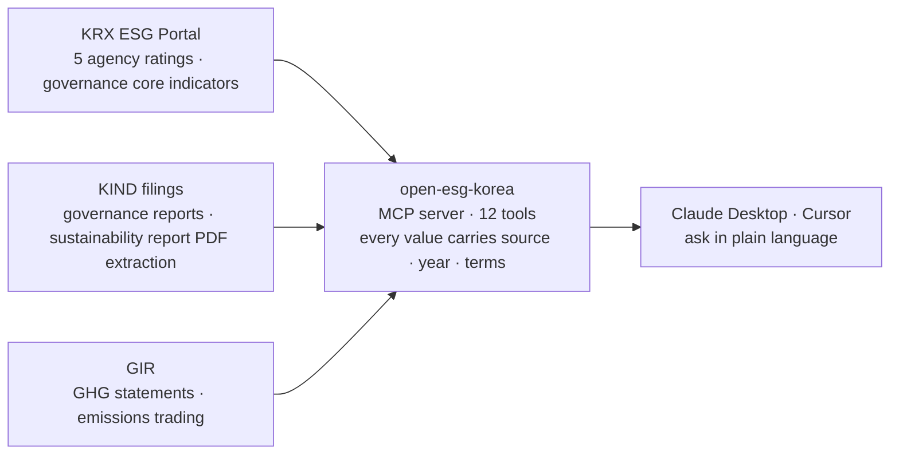

<div align="center">


# open-esg-korea

**Ask an AI about Korean listed companies' ESG data, in plain language**

"What is Samsung Electronics' ESG rating?" — that is the whole interface.

[](https://polyformproject.org/licenses/noncommercial/1.0.0/)
[](https://github.com/MarcoYou/open-esg-korea/releases/latest)
[](https://www.python.org/downloads/)
[](https://modelcontextprotocol.io/)
[](#tools-12)
[](https://github.com/sponsors/MarcoYou)

[](#step-1--pick-the-file-for-your-machine)
[](#step-1--pick-the-file-for-your-machine)
[](#what-is-inside)
[](#step-3--ask)

**[한국어](README.md)**

[Install](#-install-in-5-minutes) · [What to ask](#-what-to-ask) · [Tools (12)](#tools-12) · [Reading the output](#reading-the-output) · [For developers](#for-developers) · [Documentation](#documentation)

</div>

---

A gateway that makes ESG data on Korean listed companies easier, faster, and AI-friendly to reach — an MCP server.

It takes the **agency ESG ratings, greenhouse-gas emissions, governance indicators and report full text** scattered across
the [KRX ESG Portal](https://esg.krx.co.kr), [GIR](https://www.gir.go.kr) and [KIND filings](https://kind.krx.co.kr), and
lets AI clients (Claude Desktop, Cursor, and others) ask about them in plain language.
Same shape as its sibling project [open-proxy-mcp](https://github.com/MarcoYou/open-proxy-mcp) (DART filings analysis).



All three are reachable **without an API key**. Ratings are never stored — they are fetched live on each question.

> [!IMPORTANT]
> open-esg-korea is an MCP server that **individuals install and run on their own machine**. It does not store or
> redistribute ESG ratings or greenhouse-gas data. Ratings are each agency's copyrighted work and **none of the five
> permit public disclosure**, so collecting or redistributing this data may breach their licences. See
> [Reading the output](#reading-the-output) for the exact terms.

---

## 🚀 Install in 5 minutes

**Download one file and drop it in.** No Python, no developer tools, no API key.

### Step 1 — pick the file for your machine

<div align="center">

| Your machine | Download | Size |
|:---|:---:|:---:|
| **Mac** — M1 · M2 · M3 · M4 … | [](https://github.com/MarcoYou/open-esg-korea/releases/latest/download/open-esg-korea-macos-arm64.mcpb) | ~40MB |
| **Mac** — Intel | [](https://github.com/MarcoYou/open-esg-korea/releases/latest/download/open-esg-korea-macos-x64.mcpb) | ~44MB |
| **Windows** — 64-bit | [](https://github.com/MarcoYou/open-esg-korea/releases/latest/download/open-esg-korea-windows-x64.mcpb) | ~43MB |

</div>

<sub>**Not sure which Mac you have?** Apple menu (top-left) → *About This Mac* → the **Chip** row. `Apple M…` means Apple
Silicon; `Intel…` means Intel. Macs bought since 2020 are almost all Apple Silicon. Picking the wrong one only means the
extension will not install — nothing breaks.</sub>

<sub>There is no Linux bundle yet — use the [developer path](#for-developers).</sub>

### Step 2 — drop it into Claude Desktop

1. Open **Claude Desktop**
2. Go to **Settings → Extensions**
3. **Drag the `.mcpb` file** into the window (or use "Install extension" and pick it)
4. Click **Install**

> [!NOTE]
> You will see a red warning: "This extension will have access to everything on your computer · The developer information
> shown has not been verified by Anthropic." That means **it is not an Anthropic-reviewed extension** — every self-built
> extension is marked this way. Everything that goes into the bundle is spelled out in
> [`scripts/build_mcpb.py`](scripts/build_mcpb.py), the Python under `lib/` is readable as-is once unzipped, and each
> bundle carries a `BUILD_INFO.txt` naming the commit it was built from.

### Step 3 — ask

Just talk to Claude.

> **What is Samsung Electronics' ESG rating?**

If a five-agency rating table comes back **with sources, years and licence terms attached**, you are connected.
There is no API key step.

<details>
<summary><b>🛠️ When installation fails</b></summary>

<br>

| Symptom | Why / what to do |
|---|---|
| **Install button is greyed out** | It locks if any "Requirements" row shows ⚠. If you see a `Python` requirement you have an **old file** — get the latest release (Python is bundled) |
| **"Cannot preview this extension"** | The manifest could not be read. Get the latest release |
| **Installed, but no tools appear** | **Fully quit** Claude Desktop and reopen — `⌘Q` on macOS; on Windows the tray icon → Quit, not the window ✕ |
| **(Mac) "incompatible architecture"** | Wrong file for your chip — take the other Mac row above |
| **(Mac) it seems to be blocked from running** | The download may carry a quarantine flag. In Terminal run<br>`xattr -dr com.apple.quarantine ~/Library/Application\ Support/Claude/Claude\ Extensions/local.mcpb.MarcoYou.open-esg-korea`<br>then restart Claude Desktop |
| **Company lookups error out** | Your corporate network may be blocking KRX. Check that [esg.krx.co.kr](https://esg.krx.co.kr) opens in a browser first |
| **Still stuck** | [Open an issue](https://github.com/MarcoYou/open-esg-korea/issues) — pasting the extension folder's `BUILD_INFO.txt` makes it much faster |

</details>

### What is inside

| | |
|---|---|
| `runtime/` | A Python 3.12 distribution — **you do not need Python on the machine**<br><sub>Windows: python.org embeddable build · macOS: [python-build-standalone](https://github.com/astral-sh/python-build-standalone)</sub> |
| `lib/` | Dependencies (mcp · httpx · pypdfium2 · pdfplumber) plus the server itself |
| `manifest.json` | Extension metadata and the list of 12 tools |
| `BUILD_INFO.txt` | Which commit, when, and by what it was built |

---

## 💬 What to ask

You never need the tool names. Say what you want; Claude picks the tool.
These all work:

<details open>
<summary><b>📊 Ratings</b></summary>

> - What is Samsung Electronics' ESG rating?
> - Compare Hyundai Motor and Kia on ESG
> - Show LG Chem's 3-year KCGS trend
> - Where does SK hynix sit within that same agency?

ESG/E/S/G grades **by year** from five agencies (KCGS · MSCI · Korea ESG Research Institute · S&P · Sustinvest).
"Is this good?" is answered by **counting inside one agency** (how many at or above, how many tied) — never across
agencies, because the scales differ. [Why](#reading-the-output)

</details>

<details>
<summary><b>🏭 Greenhouse gas</b></summary>

> - SK hynix emissions for the last five years
> - POSCO Holdings: ETS allocation vs. verified emissions
> - Compare Samsung Electronics' GIR statement figures with what its report discloses
> - Rank the steel industry by emissions
> - How has Korea's road-transport sector changed since 1990?

Covers GIR statements (per company), ETS allocation vs. verified emissions, designated-industry rankings, and the
national inventory (1990 onward). When cross-checking a company's own report, it does not assert a value — it returns the
**scope axes** (boundary · Scope 2 method · whether NF₃ is included) alongside.

</details>

<details>
<summary><b>🏛️ Governance</b></summary>

> - How does Naver score on the 15 core governance indicators?
> - What did Kakao mark as non-compliant, and what reason did it give?
> - Compare Celltrion and Samsung Biologics on governance

Answered in **two layers** — the O/X indicators (15) and policy-adoption items (74) that KRX aggregates, and the
**report the company itself wrote** (28 detailed principles, stated reasons). The *why* exists only in the latter.

</details>

<details>
<summary><b>📄 Report full text</b></summary>

> - Show the table of contents of Samsung Electronics' sustainability report
> - Find where "renewable energy" appears in it
> - Show me page 42

Gives the report list, assurance provider and attached PDF address, then **reads the PDF body** to say which pages a
keyword is on and quote around it. Search ignores whitespace, so letter-spaced typesetting still matches.

</details>

<details>
<summary><b>🔍 Screening many companies at once</b></summary>

> - KCGS A+ or better, semiconductors & semiconductor equipment only
> - Which KOSPI companies published a sustainability report?
> - Chemicals companies that have an MSCI rating

Filters the whole KOSPI universe (795 companies in 2025) by **minimum grade per agency, portal industry, GICS industry
group, and whether a report exists**, and shows how the matches cluster by industry.

</details>

### Worth knowing

- **Short names work** — 현대차, 에스케이하이닉스, 삼성SDS, 케이티앤지 all resolve. When an alias is used, the response says so.
- **`-` means "not rated"** — not a zero, not a bad grade. Missing data is reported as missing.
- **KOSDAQ gets ratings only** — the portal carries KOSPI on the report and governance screens.
- **Every value carries source, year and licence terms.** Do not strip the `license` field from responses.

---

## Tools (12)

| Tool | What it answers |
|---|---|
| `company` | Company name / ticker → portal ticker and ISIN. The entry point for every other tool |
| `esg_ratings` | ESG/E/S/G grades by year from KCGS, MSCI, Korea ESG Research Institute, S&P and Sustinvest, plus a 3-year KCGS trend and **the distribution within that same agency** (how many companies at or above this grade, how many tied) |
| `sustainability_reports` | List of sustainability reports plus the filing text of one — reporting period, table of contents, assurance provider, the company's own publication page, and the attached PDF address |
| `sustainability_report_text` | **PDF body** of a sustainability report — which pages a keyword appears on, excerpts around it, or a whole page |
| `governance_indicators` | The 15 core corporate-governance indicators (O/X), compliance rate, and comparison against another company |
| `governance_policies` | 74 governance policy-adoption items |
| `governance_report` | **Full text** of the corporate-governance report — answers to the 28 detailed principles, the standard-form tables, and the stated reasons for non-compliance |
| `esg_disclosures` | Filing history of corporate-governance reports (amendments included) |
| `esg_screener` | Screener across the whole KOSPI universe (795 companies in 2025) — minimum grade per agency, portal industry, **GICS industry group**, whether a sustainability report exists, plus how the matches cluster by industry |
| `ghg_emissions` | Company greenhouse-gas emissions (GIR statements, tCO₂eq · energy TJ · verifier) with a 5-year trend and ETS allocation vs. verified emissions. With `report=True` it cross-checks the figures disclosed in the report **together with their scope** |
| `ghg_industry` | Emissions ranking by designated industry, and each entity's rank and share within that industry (statement totals) |
| `ghg_national_inventory` | Korea's national greenhouse-gas inventory — totals, five sectors, and sub-sectors (steel, cement, road transport …) from 1990 onward |

## Reading the output

- **Scales differ by agency** (KCGS S~D, MSCI AAA~CCC, S&P 0-100 score, Sustinvest AA~E). Do not line grades up across agencies.
- A **GICS industry group** (11 economic sectors · 25 industry groups) is attached to the company block of every response.
  It comes from a bundled snapshot (`open_esg_korea/data/krx_gics.json`, 2,534 KOSPI+KOSDAQ tickers), so it works with no
  key and no network. It is a **different scheme** from the portal's 21 industries and from GIR's designated industries —
  Samsung Electronics is *Hardware & IT Equipment* / *Electrical & Electronics* / *Semiconductor Manufacturing*
  respectively. Do not mix them in one table.
- "Is this good?" is answered with **the distribution inside that one agency** — never a "top N%". With only six or seven
  grades, 30–60% of companies tie (61% sit at A for Korea ESG Research Institute), so a percentile would be invented
  precision. The denominator is the number of companies that agency rated, and coverage differs a lot (2025: KCGS 782,
  MSCI 74).
- `-` (null) means **that agency did not rate the company** — not a bad grade.
- The portal's company finder covers KOSPI only. **Company-name** lookups for KOSDAQ go through a bundled listed-company
  snapshot (`open_esg_korea/data/listed_companies.json`, refreshed monthly from the OpenDART corp-code registry) — no key
  needed. Supplying `OPENDART_API_KEY` (free, [opendart.fss.or.kr](https://opendart.fss.or.kr)) uses the live registry
  instead, which also catches companies listed or renamed since the snapshot. Either way, KOSDAQ names usually resolve to
  ratings only — the report and governance screens can be empty, because the portal carries KOSPI there.
- Company names are understood through common short forms, transliterations and English brandings
  (현대차, 에스케이하이닉스, 삼성SDS, 케이티앤지). When an alias is used, the response says so.
- The `corp_code` (DART corporation number) in a `company` response can be passed straight to the sibling server
  open-proxy-mcp.
- Emissions come from the public statement data of the
  [Greenhouse Gas Inventory and Research Center (GIR)](https://www.gir.go.kr/home/index.do?menuId=37) — only entities under
  the emissions-trading or target-management schemes (roughly 1,170 a year). A company that is absent is `no_data`, not
  zero. These are verified regulatory figures (direct + indirect), so they can differ from Scope 1/2/3 in a company's own
  report. Where a subsidiary is designated separately (Samsung Display, POSCO Future M), it is shown as a "related entity".
  No key required.
- **Governance comes in two layers.** `governance_indicators` (15 O/X) and `governance_policies` (74 Y/N) are **values KRX
  aggregated**; `governance_report` is **what the company wrote** (KIND) — the *reason* for non-compliance exists only in
  the latter. If nothing can be parsed from the filing, the answer is "could not read it", never "complied with zero".
  Financial companies file a "governance annual report" instead and therefore have no detailed principles — which is not
  non-filing and not non-compliance.
- Sustainability report PDFs are read with `sustainability_report_text`. **Search ignores whitespace** — the source is
  typeset with letter-spacing, so "온실가스 배출량" appears spaced out and a literal search returns zero hits for text that
  is plainly there. A miss means "not found under this spelling", not "not present". Image-only PDFs cannot be read
  (there is no OCR).
- **Figures are not mechanically extracted from reports.** Tables come back flattened as laid out, and which year or
  segment a value belongs to has to be confirmed against the source PDF — two tables were observed bleeding together on a
  two-column page. `table=True` returns a grid, but it is **experimental**: value preservation is 97.4% (aligned text is
  100%), and cells that look split are flagged with `⚠`. If the suspect count is not zero, check against the aligned text.
- Acceptance numbers in filing lists are **KIND (exchange) numbers**. They follow a different scheme from DART acceptance
  numbers — opening the same number in the DART viewer brings up a different company's filing.
- **GIR figures and the numbers disclosed in reports are effectively the same once the scope is aligned** — a company
  files the same statement with GIR that it prints in its report (measured for 2024: POSCO Holdings 1 tonne, Hyundai Motor
  10 tonnes, SK hynix 0.10%, LG Chem 0.50% apart). Where they diverge, it is usually because the headline number in the
  report is **global** (Samsung Electronics, 9%). `ghg_emissions(report=True)` does not assert a value; it returns the
  **source excerpt together with the scope axes** (boundary · Scope 2 location/market-based · whether NF3 is included) —
  one report can carry several figures (SK hynix had three for 2024). Scope 3 is absent from GIR, so the report is the
  only source.
- **Rating data is each agency's copyrighted work, and the terms differ by agency** — KCGS and MSCI say "internal use
  only", Sustinvest and S&P say "no reproduction in any form without prior written permission", and Korea ESG Research
  Institute says "no reproduction, transmission, quotation or distribution without prior written consent".
  **None of the five permit public disclosure.** So this server fetches ratings **live only** and keeps them nowhere —
  no database, no repository, no logs (the cache is in memory alone) — and attaches each agency's notice and a
  [link to the original terms](https://esg.krx.co.kr/templets/mobile/notice-box.jsp?type=kcgs) to every value.
  Do not strip the `license` field from responses. **Exposing this as a public endpoint requires asking each agency
  first** — an individual querying for their own reading (local stdio, or a private deployment only they can reach) is
  internal use. Filing texts belong to the submitting company, so `governance_report` carries its own separate notice.


---

## For developers

```bash
uv sync
uv run python -m open_esg_korea                     # http://localhost:8000/mcp
uv run python -m open_esg_korea --transport stdio   # local Claude Desktop connection
```

Example `claude_desktop_config.json`:

```json
{"mcpServers": {"open-esg-korea": {"command": "uv", "args": ["run", "--directory", "/path/to/open-esg-korea",
  "python", "-m", "open_esg_korea", "--transport", "stdio"]}}}
```

### Building the extension yourself

```bash
uv run python scripts/build_mcpb.py                        # one bundle for this machine
uv run python scripts/build_mcpb.py --target macos-arm64   # a specific one
uv run python scripts/build_mcpb.py --target all --check   # all three, each actually launched afterwards
```

| `--target` | Runtime | `--check` runs on |
|---|---|---|
| `macos-arm64` | python-build-standalone (aarch64) | Apple Silicon |
| `macos-x64` | python-build-standalone (x86_64) | Intel Macs, or **Apple Silicon with Rosetta 2** |
| `windows-x64` | python.org embeddable build | Windows |

`--check` unpacks what it built, launches it **with the exact command in the manifest**, and confirms 12 tools answer a
stdio handshake — that is what stops "it built fine but will not open". Targets this machine cannot run are skipped.

### Tests

```bash
uv sync --dev && uv run pytest -q     # network 0
```

---

## Documentation

- [MCP draft and roadmap](docs/mcp-draft.md) — data-source map, what was confirmed about each endpoint, the reasoning per phase
- [Field notes](docs/anecdotes.md) — things only learned by knocking on the door (a DART link opens a different company, letter-spacing is baked into the PDF, the benchmark-leading parser misses our numeric tables …)

### Refreshing snapshots

| What | Command | Automation |
|---|---|---|
| GICS classification | `uv run python scripts/refresh_krx_gics.py` | `refresh-krx-gics` workflow (1st of each month, **no key needed**) |
| Listed-company registry | `OPENDART_API_KEY=... uv run python scripts/refresh_listed_companies.py` | `refresh-listed-companies` workflow (needs repo secret `OPENDART_API_KEY`) |
| National inventory | `python3 scripts/refresh_ghg_inventory.py --url '<data.go.kr 15049589 download URL>'` | none (once a year, after the December publication) |

### Live checks

```bash
python scripts/probe_krx.py 005930 2025   # has the portal response schema changed?
uv run python scripts/smoke_kind.py       # do KIND filing texts (governance, sustainability) still read?
```

---

<div align="center">
<sub>

If this is useful to you — [](https://github.com/sponsors/MarcoYou)

</sub>
</div>
